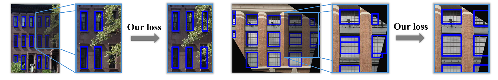

# Abstract

Standard object detectors typically treat architectural elements independently, often resulting in facade parsings that lack the structural coherence required for downstream procedural reconstruction. We address this limitation by augmenting the YOLOv8 training objective with a custom lightweight alignment loss. This regularization encourages grid-consistent arrangements of bounding boxes during training, effectively injecting geometric priors without altering the standard inference pipeline. Experiments on the CMP dataset demonstrate that our method successfully improves structural regularity, correcting alignment errors caused by perspective and occlusion while maintaining a controllable trade-off with standard detection accuracy.

# Video

<div style="display: flex; justify-content: center;">
  <iframe
    width="560"
    height="315"
    src="https://www.youtube.com/embed/Sk1JUOE0pIg"
    title="YouTube video player"
    frameborder="1"
    allow="accelerometer; autoplay; clipboard-write; encrypted-media; gyroscope; picture-in-picture"
    allowfullscreen>
  </iframe>
</div>

# BibTeX

```
TBD
```
